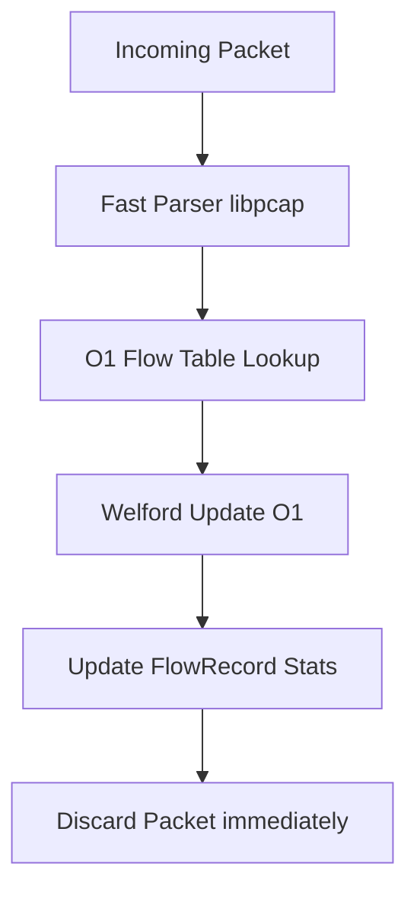

# Comparative Performance Report: AegisFlow vs. CICFlowMeter

This report compares **AegisFlow** (C17) with **CICFlowMeter** on throughput and on the design choices behind it.

---

## 1. Measured Results

| Measurement | CICFlowMeter | AegisFlow | Result |
| :--- | :--- | :--- | :--- |
| **End-to-end throughput** (ICS PCAP, 2.27M packets, full CSV export) | ~6.5k packets/sec | ~39k packets/sec | **6.1x faster** |
| **Output schema** | 84 columns | 84 columns (5 identifiers + 79 flow features) | Drop-in compatible |

The end-to-end run is the headline number: both tools read the same capture from disk, parse every packet and write the full feature CSV.

**Synthetic microbenchmark (not a tool-vs-tool comparison).** `bench_flow` feeds synthetic packets directly into the flow table and feature engine in memory, with no PCAP parsing or disk I/O. It reaches ~6.9M packets/sec (~145 ns/packet) on a 2-core cloud VM. This isolates the per-packet update path and should not be compared against CICFlowMeter's end-to-end throughput.

---

## 2. Core Architectural Advantages

The throughput difference comes mainly from two design choices:

### A. Incremental Feature Extraction (Welford's vs. Buffering)
- **CICFlowMeter (Java)** retains packet listings and IAT lists in memory for every active flow. To calculate statistics like standard deviation, mean, and variance, it performs multi-pass loop traversals over the collected packet arrays.
- **AegisFlow (C)** stores **zero packets**. It maintains a constant-size `FlowRecord` (800 bytes) and updates statistics incrementally in **\(O(1)\) time** using **Welford's online algorithm** for mean and variance:



### B. Memory Footprint Comparison
Because CICFlowMeter stores packet references, memory consumption scales linearly with the number of packets processed. If a single TCP flow transfers millions of packets (e.g., a file download), the JVM heap can swell by hundreds of megabytes for that single flow.
AegisFlow remains flat regardless of packet volume:

```
Memory per Flow (Bytes)
      ▲
      │                              / CICFlowMeter (scales with packets)
      │                             /
      │                            /
      │                           /
      │                          /
      │                         /
      │                        /
  800 ┼───────────────────────/────────────────────── (AegisFlow: flat 800B)
      │
      └─────────────────────────────────────────────►
                                     Number of Packets
```

---

## 3. Other Design Differences

- **Streaming export:** flows are written to CSV/NDJSON as soon as they close (FIN/RST or timeout) through a pluggable `ExporterChain`, instead of at the end of a batch run. Export is synchronous and single-threaded.
- **Safe numerics:** division-by-zero, NaN and infinity values are replaced with `0.0` before export, so downstream ML pipelines never receive `NaN`/`Infinity` strings.
